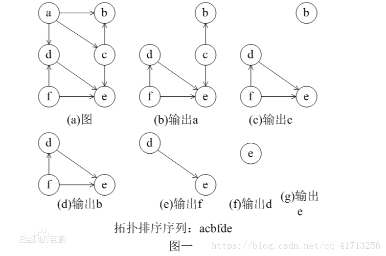

## 题意
共有n门课要上，分别用0到n-1表示。有些课程必须要先上完其他课程，才能选修。例如，要想选修课程0，必须要先选修课程1，用一个pair来表示：[0,1]。给定课程总数和课程间的依赖关系，判断是否可能修完所有课程？
## 思路
拓扑排序。题目可抽象成有向图。此题目等价于判断一个有向图中是否有环。如果有环存在，则拓扑排序不存在，因此就不可能选修完所有课程。可以将图的拓扑排序看做是将图的所有节点在一条水平线上排开，图的所有有向边都从左指向右。
* 在一个有向图中，对所有的节点进行排序，要求没有一个节点指向它前面的节点。

步骤如下：
* 先把图的表示形式改成邻接表。对于有向图，邻接表也叫出边图。vi的邻接表中每个表结点都对应于以vi为始点射出的一条边。
* 先统计所有节点的入度，对于入度为0的节点就可以分离出来，然后把这个节点指向的节点的入度减一。
* 一直做改操作，直到所有的节点都被分离出来。
* 如果最后还存在入度不为0的节点，那就说明有环，不存在拓扑排序，也就是很多题目的无解的情况。

下面是算法的演示过程。

