## 题意
二叉树的中序遍历。
## 思路
递归的方法非常好写。python的版本中，因为list是可变的，所以直接传参没问题，函数里面对list的append操作可以传出来。

迭代的思路，用栈。中序遍历的顺序为左-根-右，具体算法为：
- 从根节点开始，先将根节点压入栈。
- 然后再将其所有左子结点压入栈，取出栈顶节点，保存节点值。
- 再将当前指针移到其右子节点上，若存在右子节点，则在下次循环时又可将其所有左子结点压入栈中，重复上步骤。示意图如下：
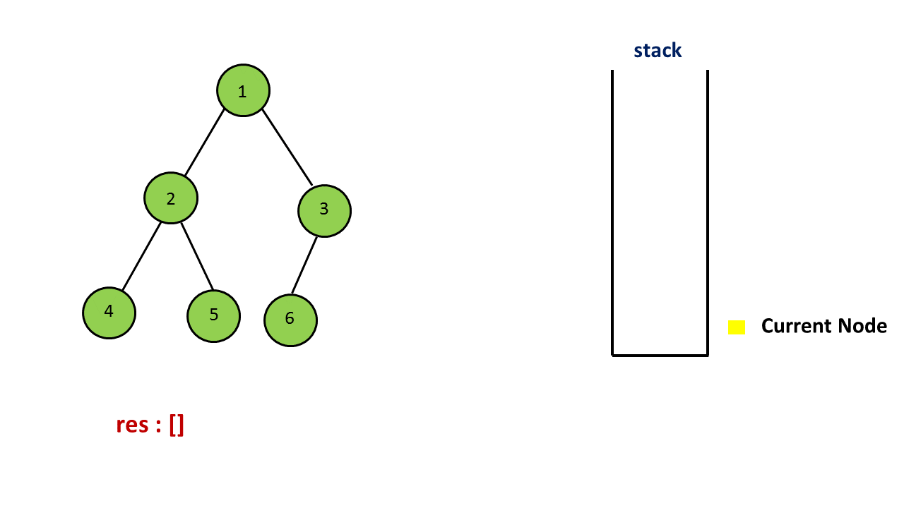
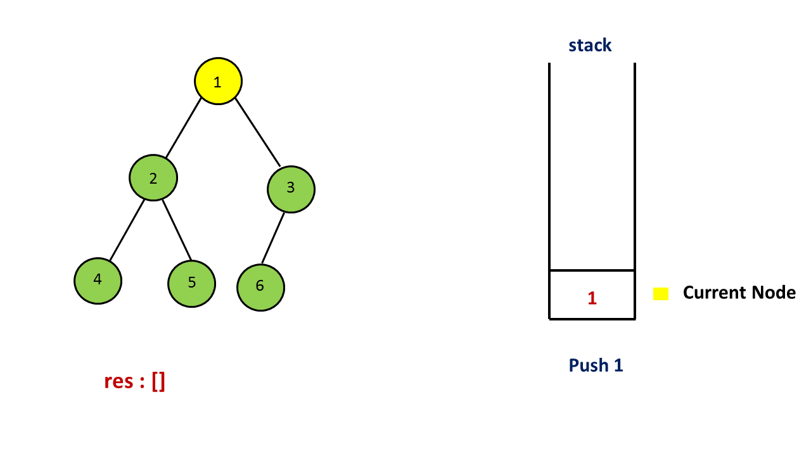
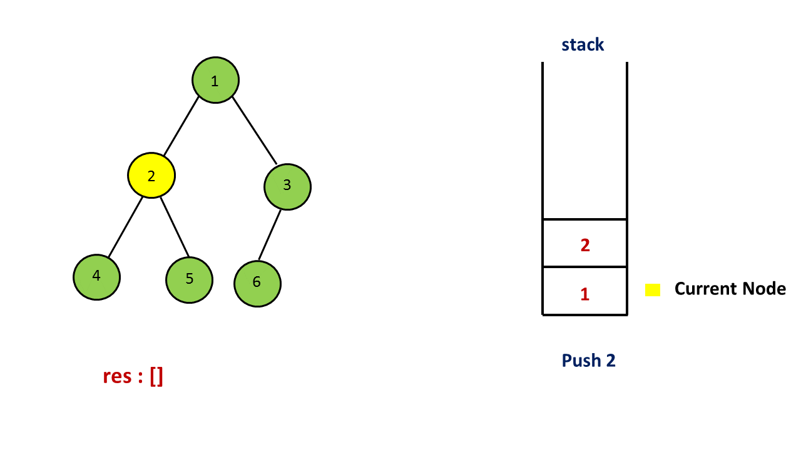
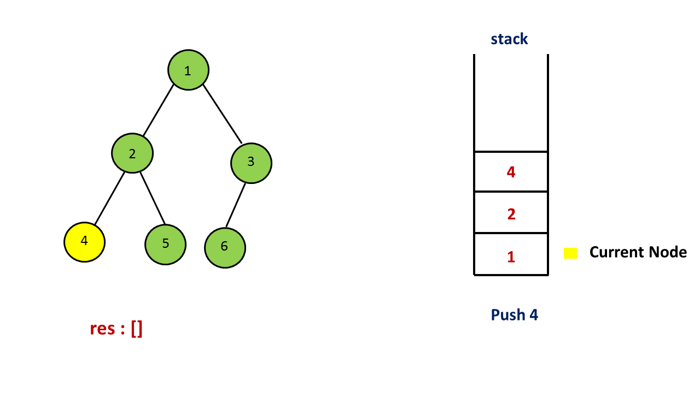
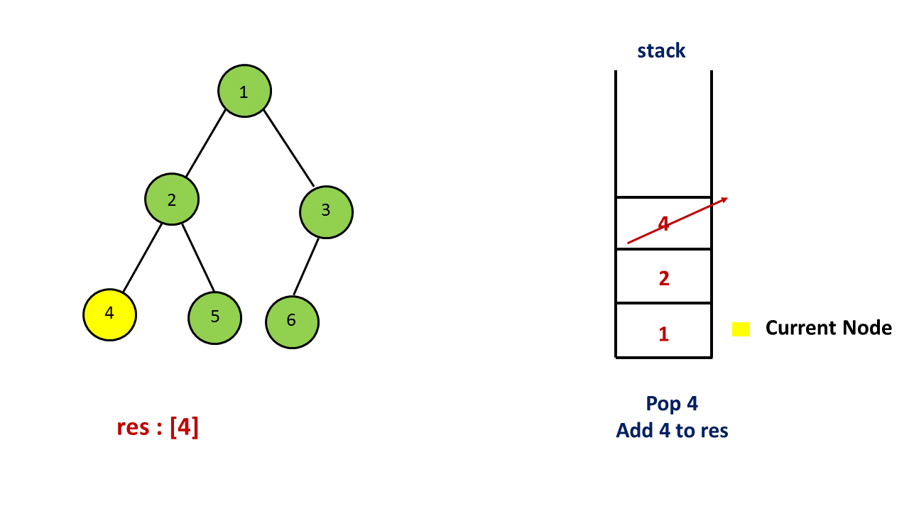
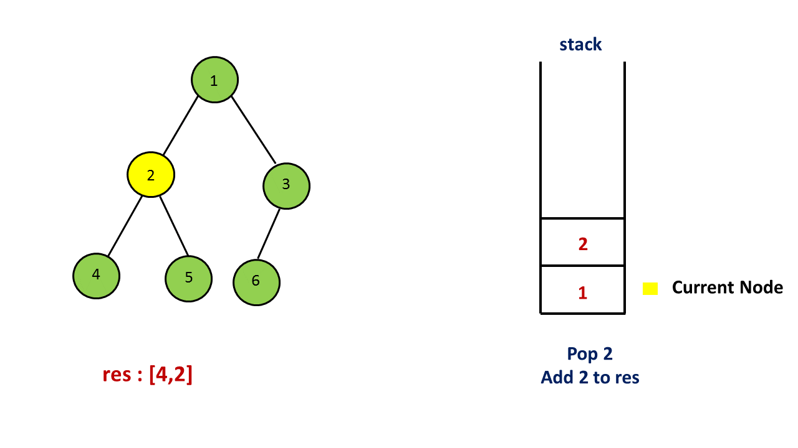
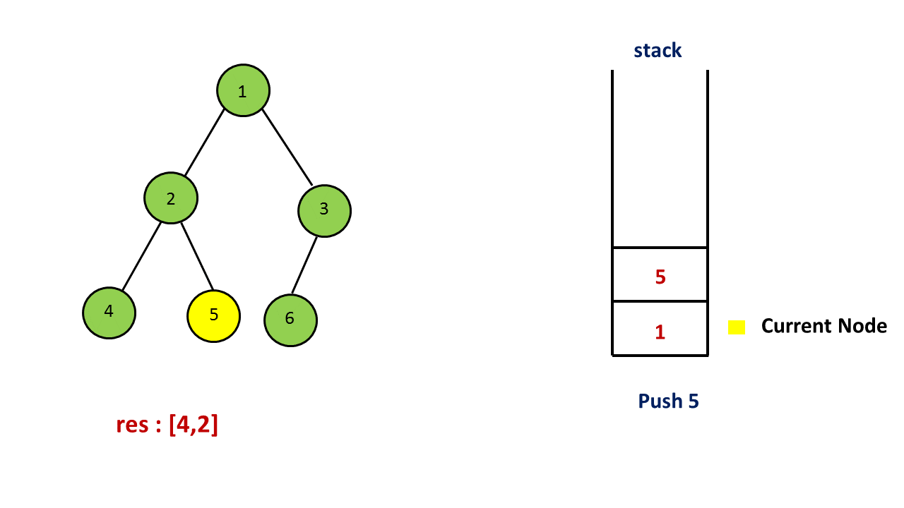
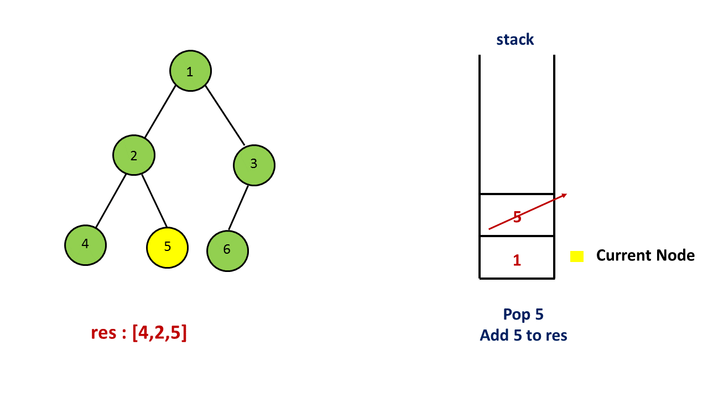
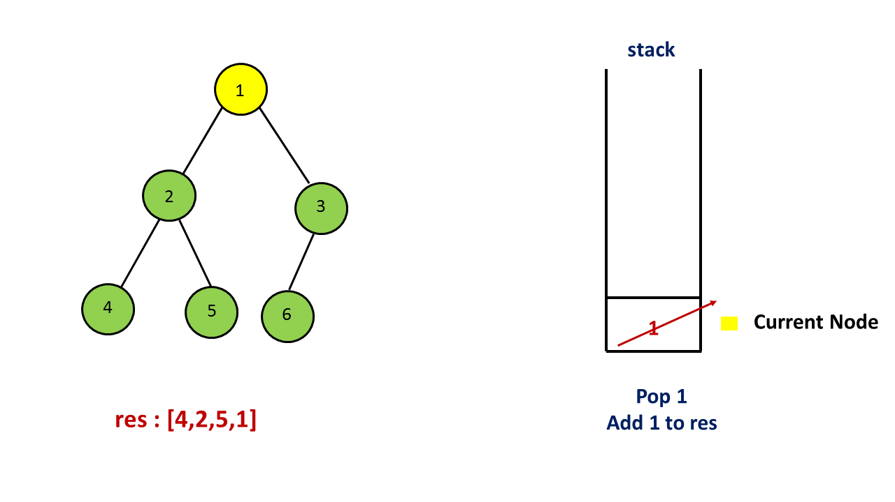
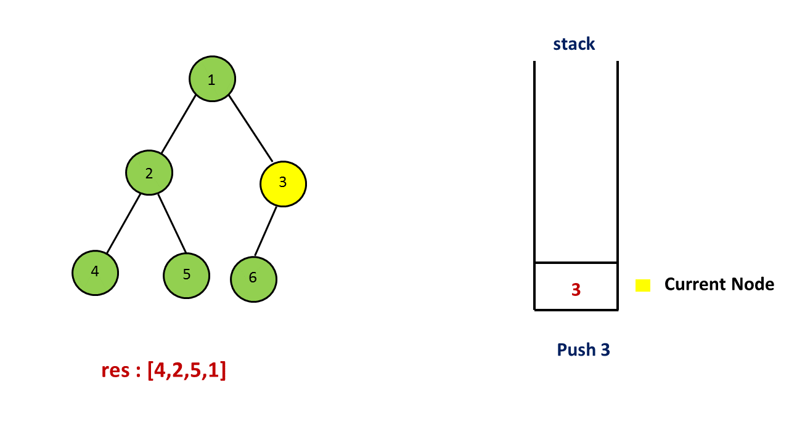
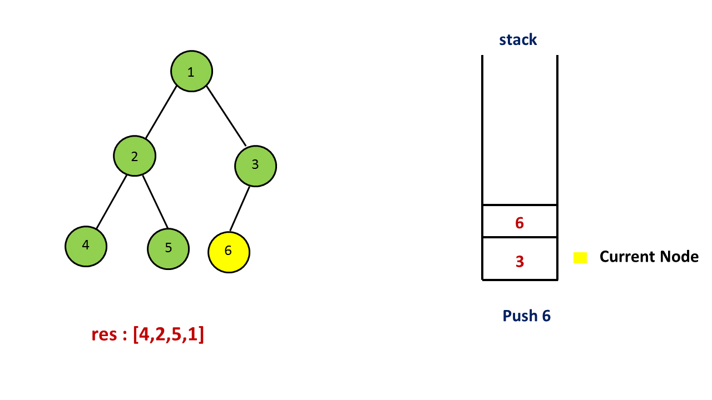
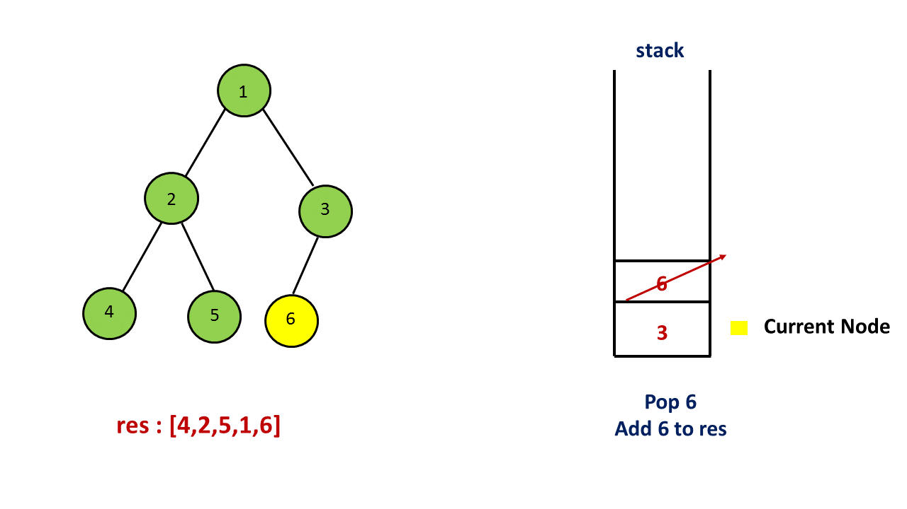
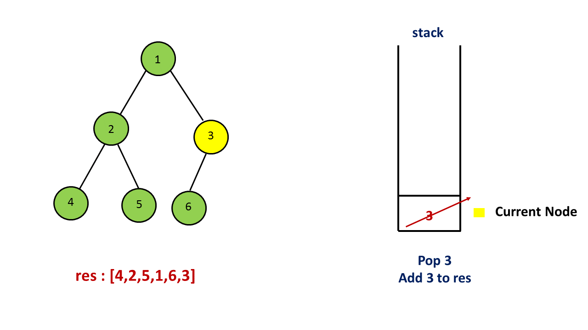
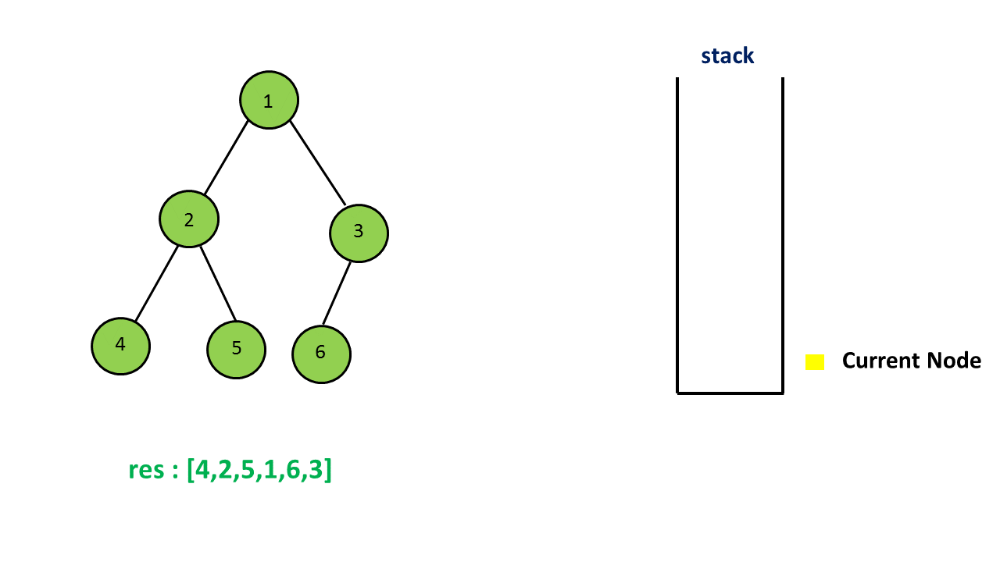
